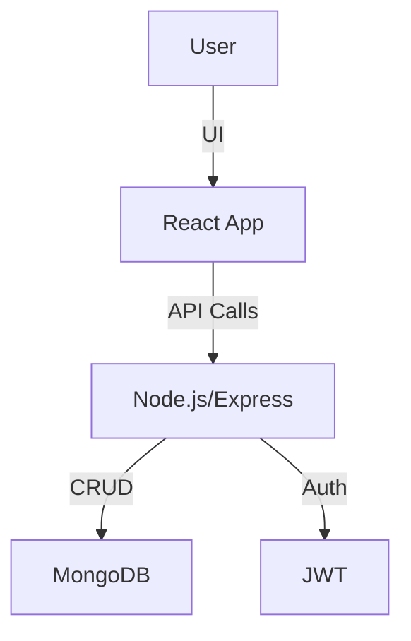

# Ticket Booking System

A full-stack ticket booking platform inspired by BookMyShow, enabling users to browse shows, book tickets, and manage their bookings seamlessly.

---

## 🚀 Project Introduction

This project is a robust, scalable ticket booking system featuring both frontend and backend. Users can search for events, select seats, book tickets, and view booking history. Admins can manage shows and bookings.

---

## 🛠️ Tech Stack

- **Frontend:** React.js, Redux, Tailwind CSS
- **Backend:** Node.js, Express.js
- **Database:** MongoDB (Mongoose ODM)
- **Authentication:** JWT-based Auth
- **Other:** RESTful APIs, Axios, dotenv

---

## 🗺️ Architecture Diagram



---

## 🌐 Live Links

- **Frontend:** [https://bookmyshow-clone-frontend.example.com](https://bookmyshow-clone-frontend.example.com)
- **Backend API:** [https://bookmyshow-clone-backend.example.com/api](https://bookmyshow-clone-backend.example.com/api)
- **Demo:** [https://bookmyshow-clone-demo.example.com](https://bookmyshow-clone-demo.example.com)

---

## ✨ Features

- User registration & login (JWT Auth)
- Browse shows/events
- Seat selection & ticket booking
- Booking history & details
- Admin panel for managing shows/bookings
- Responsive UI

---

## 🛠️ Getting Started

### 1. Cloning the Repo

```bash
git clone https://github.com/yourusername/bookmy.git
cd bookmy
```

### 2. Installing Dependencies

#### Frontend

```bash
cd frontend
npm install
```

#### Backend

```bash
cd ../backend
npm install
```

### 3. Running Locally

#### Backend

```bash
cd backend
npm run dev
```

#### Frontend

```bash
cd ../frontend
npm start
```

- The frontend runs on `http://localhost:3000`
- The backend runs on `http://localhost:8080`

---

## 🖼️ Screenshots

| Home Page | Booking Flow | Admin Panel |
|-----------|--------------|-------------|
|  |  |  |

---

## 🛣️ Future Roadmap

- Payment gateway integration
- Email/SMS notifications
- Enhanced admin analytics
- Multi-language support

---

## 🤝 Contributing

Pull requests are welcome! For major changes, please open an issue first.

---

## 📄 License

[MIT](LICENSE)